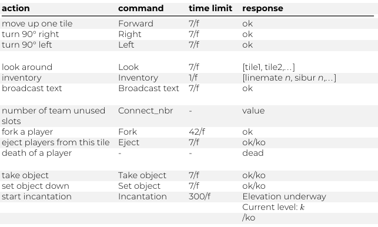
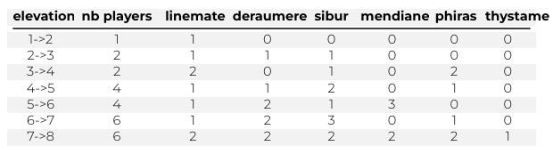
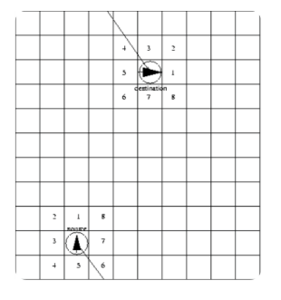

# IA

Ce projet comporte égalemet une partie intelligence artificielle

Elle se présente sous la forme d'un client du serveur codé en python.

Elle intéragit en envoyant des commandes selon la situation afin de permettre aux personnage de survivre et de monter de niveau

Chaque client est doté d'un ordre de priorité selon la situation

- Si le client à très peu d'unité de nourriture, alors il faut en chercher à l'aide de `look`.

- Si le client a un nombre suffisant de nourriture mais qu'il n'a pas les prérequis de pierre pour monter de niveau, alors il va chercher des pierres à l'aide de `look`.

- Si le client peut évoluer alors il va envoyer un message avec `broadcast` à tous les joueurs afin de trier qui peut évoluer avec lui, ce derniers vont alors le rejoindre grace au système de direction donné par le message

