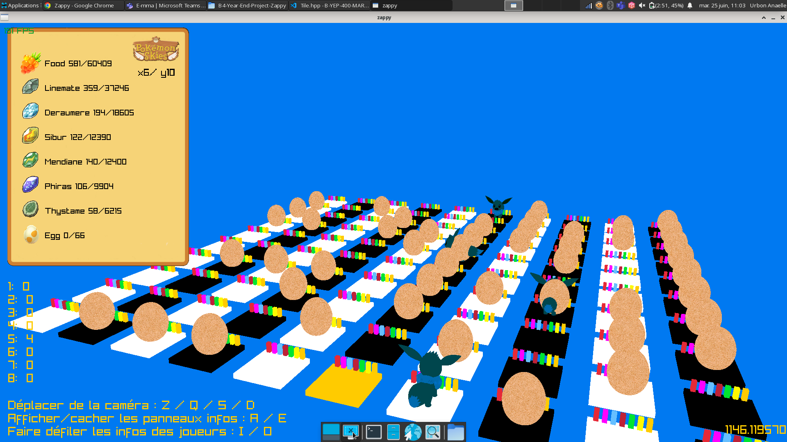

# Documentation Zappy

Bienvenue sur la documentation du projet Zappy

Il s'agit du projet de fin de 2ème année à Epitech

Il fut réalisé en équipe de 5 à 6

| [ Elisa Huang ](https://github.com/Ghost8-0-8) | [ Nattan Cochet](https://github.com/NattanCochet) | [ Adam Benzidane](https://github.com/quidamzx) | [ Vincent Montero Fontaine](https://github.com/Priax) | [ Sonny Rameaux](https://github.com/Sonny-Rameaux) | [ Anaëlle Urbon](https://github.com/Anagon1803) |
| :---: | :---: | :---: | :---: | :---: | :---: |
| IA | IA | Serveur & GUI | Serveur | GUI | GUI |

L'objectif est de réaliser un jeu où des personnages doivent évoluer à l'aide de ressources et de coopération.

Il est composé en 3 parties :

- Un serveur gérant la partie
- Des IA qui occupent le rôle de la prise de décision de chaque personnage
- Une interface utilisatrice permettant d'observer le tout

